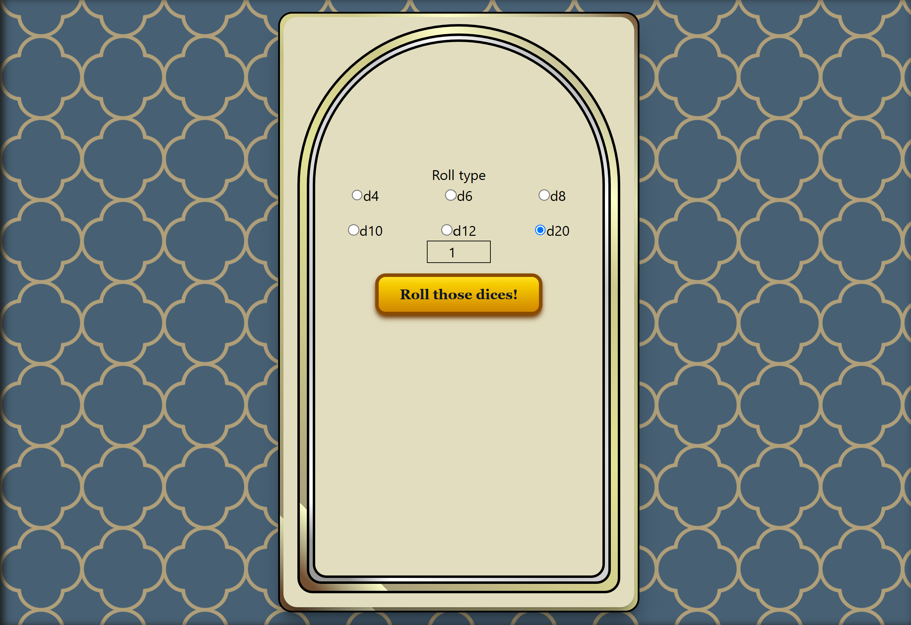

# Roll those dices

**Note:** this is still a WIP project.

A simple and intuitive web application that allows users to roll virtual dice for tabletop RPGs such as Dungeons & Dragons, Pathfinder, and more. Choose your dice type (d4, d6, d8, d10, d12, d20, etc.) and the number of dice to roll — perfect for character creation, combat, or skill checks.

May luck offer you a natural 20.

## Features

- Select from common RPG dice types: d4, d6, d8, d10, d12, d20, and d100
- Choose the number of dice to roll (1 to 100+)
- Instant result display

## Checklist

- [x] Allow to roll dices
- [x] Make the minium viable product
- [ ] Finish the interface
- [ ] Optional modifiers (+/-) for rolls

## 📸 Screenshots



### Installation

Install the dependencies:

```bash
npm install
```

### Development

Start the development server with HMR:

```bash
npm run dev
```

## Building for Production

Create a production build:

```bash
npm run build
```
